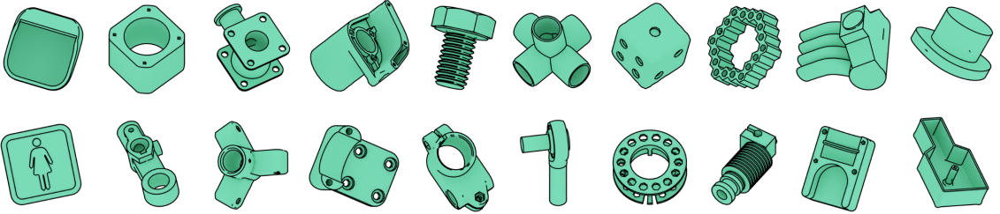
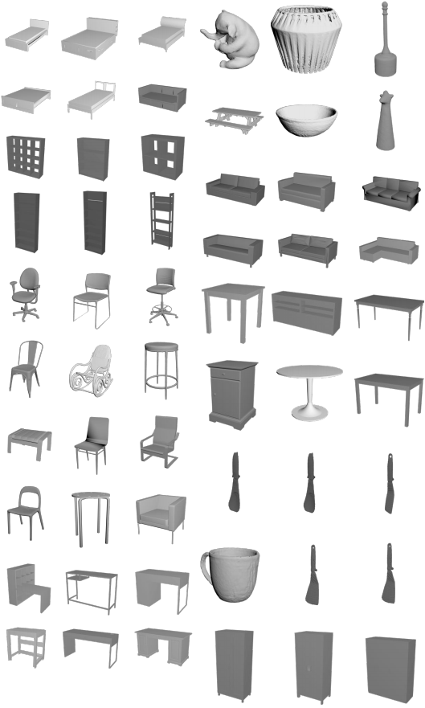
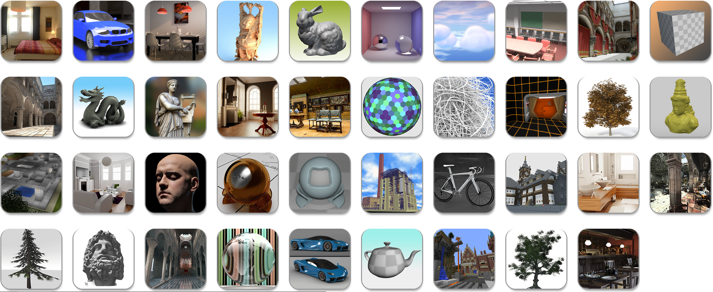
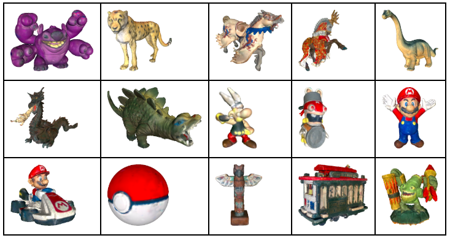
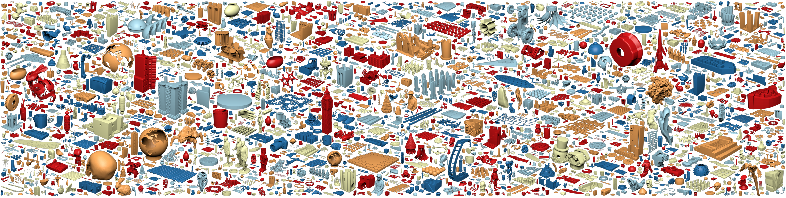
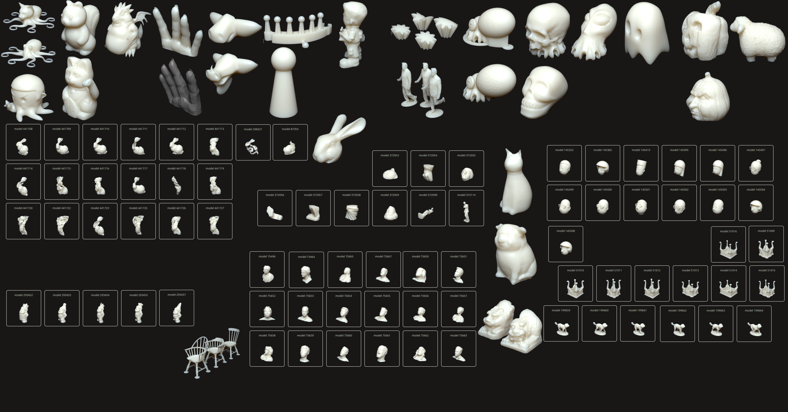
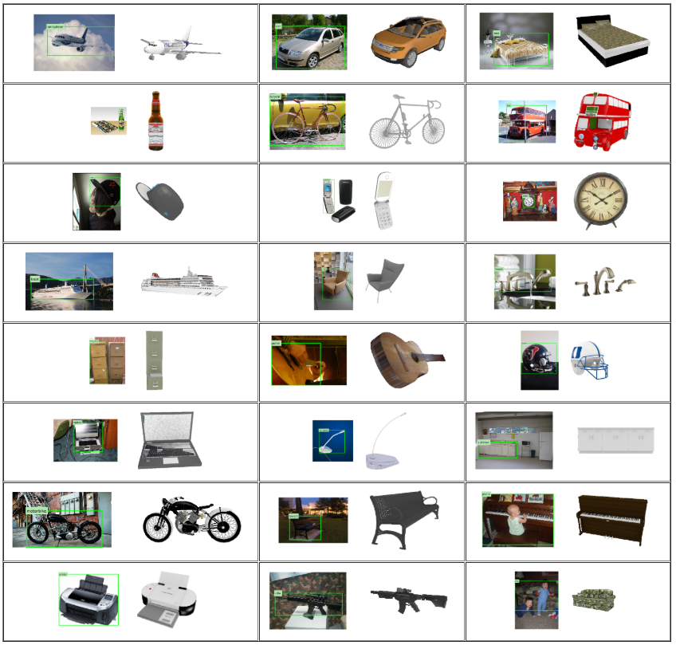
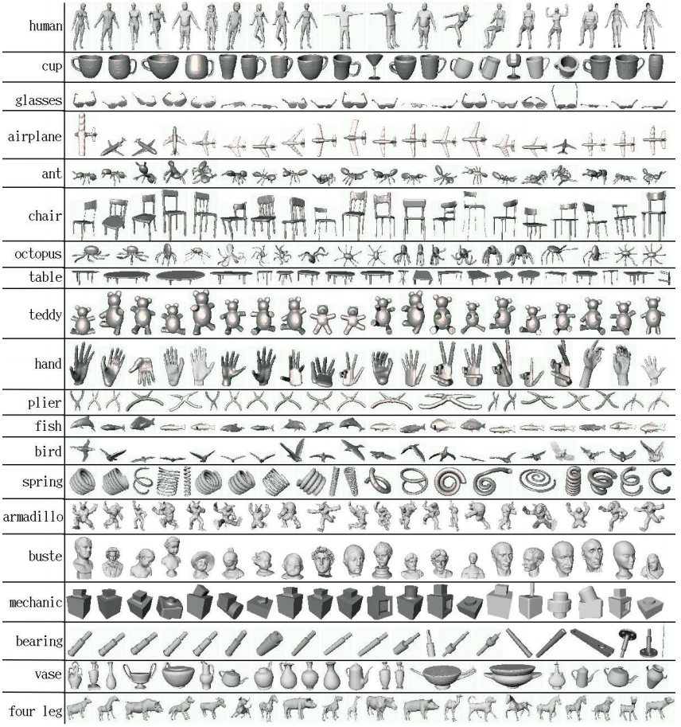
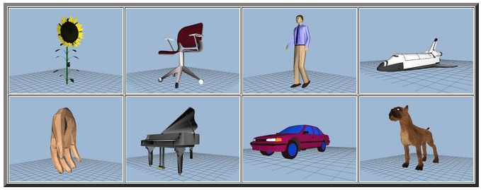

# compilation-of-3d-mesh-model-resources
A compilation of 3D mesh models found on the web for research purposes.

__Disclamair__: All images shown here are the sole porperty of their respective owneres. I do not claim any authority over them.

1. [ABC Dataset](https://deep-geometry.github.io/abc-dataset/), 2019

    

    
    Random examples from the dataset. Most models are mechanical parts with sharp edges and well defined surfaces

2. [SHREC'19](https://shrec19.cs.cf.ac.uk/), Shape Correspondence with Isometric and Non-Isometric Deformations, 2019

   
   
3. [SHREC'19](http://profs.scienze.univr.it/~marin/shrec19/), Correspondence in Humans with Different Connectivity, 2019

   

2. [Pix3D](http://pix3d.csail.mit.edu/), 2018
   
   

3. [Morgan McGuire, Computer Graphics Archive](https://casual-effects.com/data/), 2017

    

4. [MPII Human Shape](http://humanshape.mpi-inf.mpg.de/#)

   

4. [GREYC 3D Colored Mesh Database](https://downloads.greyc.fr/Greyc3DColoredMeshDatabase/), 2017

    

6. [Thingi10K](https://ten-thousand-models.appspot.com/), 2017
   
   
   

5.  [ObjectNet3D](http://cvgl.stanford.edu/projects/objectnet3d/), 2016

    

7. [ShapeNet](http://shapenet.cs.stanford.edu/shrec16/), 2016

8. [NIST CAD Models](https://catalog.data.gov/dataset/nist-cad-models-and-step-files-with-pmi), 2016

   
   
9. [Kids with Topological Noise](https://vision.in.tum.de/data/datasets/topkids), 2016

   

9. [TOSCA PARTIAL](https://vision.in.tum.de/data/datasets/partial), 2015

   

9. [ModelNet](http://modelnet.cs.princeton.edu/#), 2015

      

11. [PASCAL+](http://cvgl.stanford.edu/projects/pascal3d.html), 2014

    
    
12. [FAUST](http://faust.is.tue.mpg.de/), 2014

    
   
12. [Kids](https://vision.in.tum.de/data/datasets/kids), 2014

    
    
13. [Human 3.6](http://vision.imar.ro/human3.6m/description.php), 2014

    .|.|.
    :--------------------------------------------------------------------------------------------:|:-------------------------------------------------------------------------------------------------:|:-------------------------------------------------------------------------------------:
    ||||
    
14. [Body Models](https://graphics.soe.ucsc.edu/data/BodyModels/), 2014

    
    
13. [Clutter](https://vision.in.tum.de/data/datasets/clutter), 2013

    

10. [IKEA Dataset](http://ikea.csail.mit.edu/), 2013

    .|.|.
    :--------------------------------------------------------------------------------------------:|:-------------------------------------------------------------------------------------------------:|:-------------------------------------------------------------------------------------:
    ||||
    ||||

11. [SHREC'10,'11](http://tosca.cs.technion.ac.il/book/shrec.html), 2010, 2011

    .|.|.
    :--------------------------------------------------------------------------------------------:|:-------------------------------------------------------------------------------------------------:|:-------------------------------------------------------------------------------------:
    ||||

12 [A Benchmark for 3D Mesh Segmentation](http://segeval.cs.princeton.edu/), 2009

   

12. [TOSCA High-res](http://tosca.cs.technion.ac.il/book/resources_data.html), 2008

    
    
13. [McGill 3D Shape Benchmark](http://www.cim.mcgill.ca/~shape/benchMark/), 2008

    

11. [SHREC'07, Watertight Dataset](http://watertight.ge.imati.cnr.it/), 2007

    
    
12. [Human Face](http://tosca.cs.technion.ac.il/book/resources_data.html), 2006

    

12. [Non-rigid world](http://tosca.cs.technion.ac.il/book/resources_data.html), 2006

    

12. [SCAPE](http://ai.stanford.edu/~drago/Projects/scape/scape.html), 2004

    

12. [The Brown Mesh Set](http://graphics.cs.brown.edu/games/brown-mesh-set/), 2004

    

12. [Mesh Data from Deformation Transfer for Triangle Meshes](http://people.csail.mit.edu/sumner/research/deftransfer/data.html), 2004

    .|.|.|.|.
    :--------------------------------------------------------------------------------------------:|:-------------------------------------------------------------------------------------------------:|:-------------------------------------------------------------------------------------:|--:|--:|
    ||||||
    ||||||

12. [The Princeton Shape Benchmark](http://shape.cs.princeton.edu/benchmark/), 2003
   
   

## Other Miscellaneous Data

-  [Keenan's 3D Model Repository](https://www.cs.cmu.edu/~kmcrane/Projects/ModelRepository/)

   
   
   .|.|.|.|.
   :--------------------------------------------------------------------------------------------:|:-------------------------------------------------------------------------------------------------:|:-------------------------------------------------------------------------------------:|--:|--:|
   ||||||

-  [The Utah 3D Animation Repository](http://www.sci.utah.edu/~wald/animrep/)

   .|.|.|.|.|.
   :--------------------------------------------------------------------------------------------:|:-------------------------------------------------------------------------------------------------:|:-------------------------------------------------------------------------------------:|--:|--:|--:|
   |||||||

-  [The Stanford 3D Scanning Repository](http://graphics.stanford.edu/data/3Dscanrep/)

   .|.|.|.|.|.
   :--------------------------------------------------------------------------------------------:|:-------------------------------------------------------------------------------------------------:|:-------------------------------------------------------------------------------------:|--:|--:|--:|
   |||||||

-  [Killeroo 3D Scan](http://www.headus.com.au/samples/killeroo/index.html)
  
   

-  [Cyberware Whole Body Scans](http://www.headus.com.au/samples/vrml.html)
  
    .|.|.|.|.
    :--------------------------------------------------------------------------------------------:|:-------------------------------------------------------------------------------------------------:|:-------------------------------------------------------------------------------------:|--:|--:|
    ||||||

-  [MPI Informatics Building Model](http://resources.mpi-inf.mpg.de/mpimodel/v1.0/)

    

-  [Cornell Box](http://www.graphics.cornell.edu/online/box/data.html)

    

-  [NASA 3D Model Repo](https://nasa3d.arc.nasa.gov/models)

   .|.|.|.|.|.
    :--------------------------------------------------------------------------------------------:|:-------------------------------------------------------------------------------------------------:|:-------------------------------------------------------------------------------------:|--:|--:|--:|
    |||||||

-  [Aim@Shape](http://visionair.ge.imati.cnr.it/ontologies/shapes/)

-  [ORCA: Open Research Content Archive](https://developer.nvidia.com/orca)

   .|.|.|.
    :--------------------------------------------------------------------------------------------:|:-------------------------------------------------------------------------------------------------:|:-------------------------------------------------------------------------------------:|--:|
    |||||
    
-  [MorphoSource](https://www.morphosource.org/)

   

## Other compilations

- [Wikipedia - List_of_common_3D_test_models](https://en.wikipedia.org/wiki/List_of_common_3D_test_models)

- [Aim@Shape Links](http://visionair.ge.imati.cnr.it/ontologies/shapes/link.jsp)

- [Level of Detail for 3D Graphics](http://lodbook.com/models/)

- [Point Cloud Library Dataset](http://www.pointclouds.org/news/2013/01/07/point-cloud-data-sets/)
